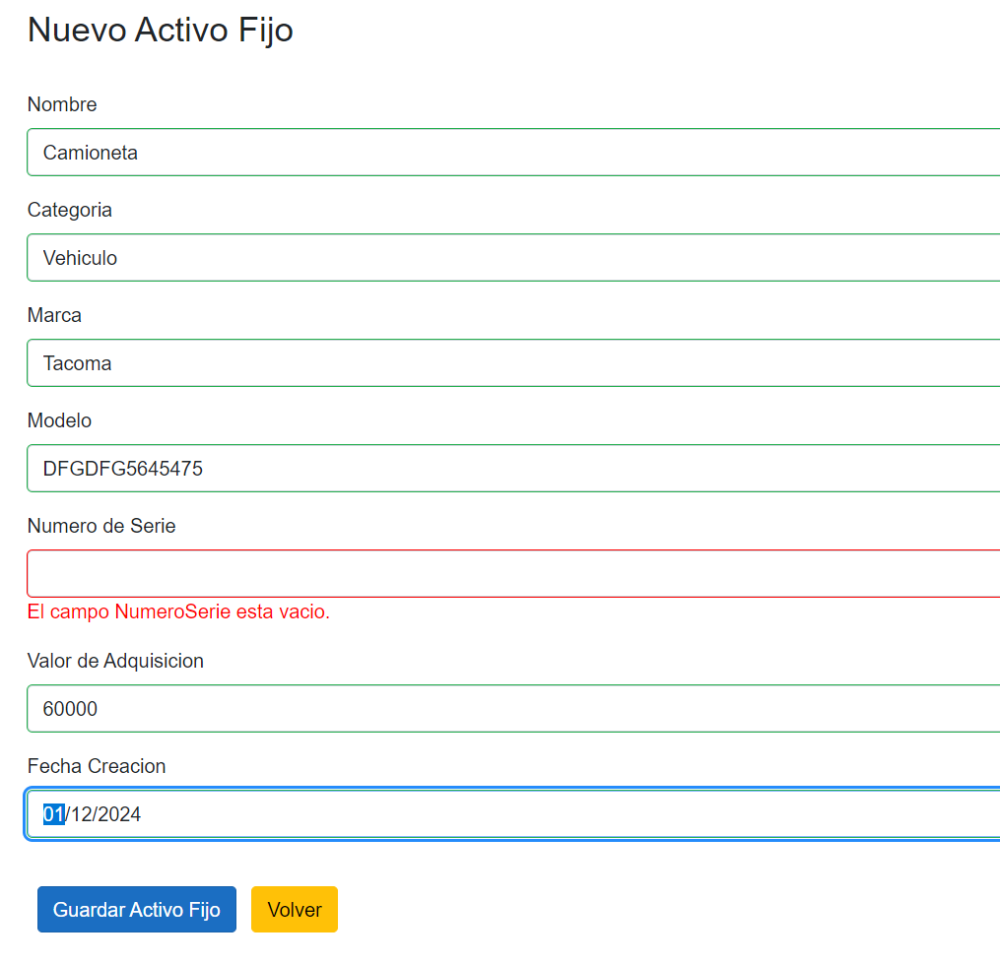

# Accounting Records
This project covers the requirements for managing the fixed assets of a company in order to obtain relevant information about them, such as the identification code, brand, model, serial number, category, and acquisition value.

The requirements are:
- Register a category and a fixed asset.
- View the list of categories and fixed assets.
- Assign a 12-digit code randomly with an initial prefix each time a new fixed asset is registered.
- Include validation to avoid repeating the previous code.
- Sort fixed assets by registration date.
- Add filters for asset code, brand, model, and category.

## Content
- [API](#api)
- [Tutorial](#tutorial)
  * [Category List](#category-list)
  * [Create New Category](#create-new-category)
  * [Fixed Assets List](#fixed-assets-list)
  * [Create New Fixed Asset](#create-new-fixed-asset)
  * [Filter](#filter)
- [App Demonstration](#app-demonstration)

## API
There are only 4 endpoints to demonstrate what user wanted in the beggining of the project.

GET: /api/ActivoFijo/list => get list of fixed assets. 
GET: /api/Categoria/list => get list of categories. 
POST: /api/ActivoFijo/save => create a new fixed asset. 
POST: /api/Categoria/save => create a new category. 

	

## Tutorial
## Category List
When the app is ready, you can see a list of all fixed assets, click in "Categorias" from the left panel to create a new category. You will redirected to "Lista de Categorias" page.

	

## Create New Category
To create a new category, click on "Crear Nueva Categoria" green button, located at the top of the app. Then, type the name of the new category.
When the field is completed (can't be empty), click on "Guardar Categoria". If everything is right, a message with a green check will be displayed on screen.
You can go back to category list by clicking on "Volver" yellow button.

	

	

If field is empty, you will get the message "El campo no puede estar vacio".

	

## Fixed Assets List
When the app is ready, you can see a list of all fixed assets.

	

## Create New Fixed Asset
To add a new asset, click on "Crear Nuevo Activo Fijo" green button, located at the top of the app. Then, start completing the fields:
Nombre, Categoria, Marca, Modelo, Numero de Serie, Valor de Adquisicion and Fecha de Creacion (these fields can't be empty).

When fields are completed, click on "Guardar Activo Fijo" blue button to save data. If everything is right, a message with a green check will be displayed on screen. 
You can go back to category list by clicking on "Volver" yellow button.

	

If field is empty, you will get the message "El campo no puede estar vacio".

	

## Filter
When fixed asset is registered, you can search it on the filter bar by asset code, brand, model, and category.

	

## App Demonstration
[App Demo]([https://pages.github.com/](https://drive.google.com/file/d/19GxcjkZZYj7ZYvh8NOW6YXPrSXuDS81W/view?usp=sharing)https://drive.google.com/file/d/19GxcjkZZYj7ZYvh8NOW6YXPrSXuDS81W/view?usp=sharing).

 

